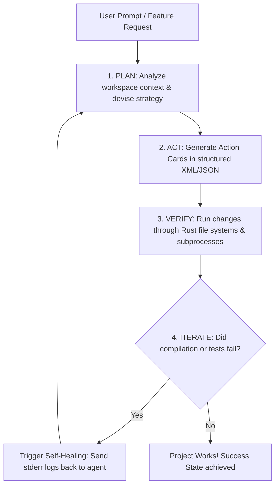
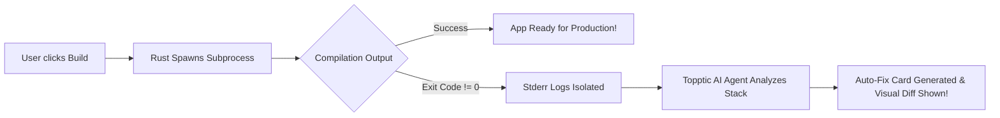

# 🏗️ Topptic AI - System Architecture Blueprint

Topptic is built with a hybrid desktop architecture designed to maximize performance on low-spec hardware by avoiding the heavy resource footprints of standard Electron-based applications. It integrates a local-first **Agentic AI Engine** directly inside a native Rust desktop shell.

---

## ⚡ Technology Stack

Topptic relies on a curated, high-performance local-first stack:

| Layer | Technology | Role / Purpose |
| :--- | :--- | :--- |
| **Frontend UI** | Next.js 14 + Monaco Editor | Fast responsive layout & lazy-loaded high-performance buffer rendering. |
| **Desktop Shell** | Tauri v2 + Rust | Spawns system calls, handles file system hooks, and manages native processes. |
| **Storage Engine**| SQLite 3 (WAL Mode Enabled) | Stores workspace metadata, index caches, and chat logs with 0MB startup RAM. |
| **Inference Engine**| Ollama / llama.cpp | Natively routes prompt queries to highly optimized GGUF quantizations. |
| **Fast Brain** | Custom PyTorch GPT | Fast local autocompletes running comfortably inside ~50MB of RAM. |

---

## 🤖 Topptic AI Agentic Architecture

The core superpower of Topptic is its **100% offline agentic programming engine**, designed to act identically to the high-end reasoning systems developed by leading AI labs.

### 1. The 4-Step Agentic Loop (PLAN ➔ ACT ➔ VERIFY ➔ ITERATE)

- **PLAN**: The agent parses the instruction, reads the relevant file context using custom Rust file system commands, and devises a step-by-step strategy (supporting natural Hinglish/English queries).
- **ACT**: Instead of raw text, the agent generates actionable patches inside `<topptic_action>` cards. These represent local tools: `write_file` or `execute_command`.
- **VERIFY**: Once the user approves the visual line diff in the Action Card, the Rust backend executes the modification, captures stdout/stderr, and returns it to the agent stream.
- **ITERATE**: The agent reviews the compilation output. If a bug is detected, it automatically iterates by generating a new action patch.

---

## 🛠️ The Self-Healing Compiler Loop

When a user clicks the **Build** panel, Topptic runs a multi-threaded compilation pipeline powered by the Rust backend.

1.  **Tauri Spawning**: The Rust backend spawns a platform-specific compiler process (e.g., `cargo build`, `npm run build`, `python`, or `g++`).
2.  **Telemetry Capture**: Stdout and Stderr are piped in real-time. If the exit code is non-zero, the exact compiler stderr log is isolated.
3.  **Heuristics Injection**: The error stack is loaded into the **Topptic AI** context along with the active file buffer. The agent produces a targeted code patch, preventing the developer from having to debug manually.

---

## 🏗️ Rust IPC Command Architecture

Tauri acts as the typed, secure gateway between the Next.js sandboxed frontend and the host operating system. Heavy operations never block the frontend render cycle.

-   **File operations (`fs_ops.rs`)**: Manages reading, writing, directory listing, and workspace state securely. Includes strict sandbox boundary checks.
-   **Command runner (`commands.rs`)**: Manages running shells and captures real-time stdout streams to pipe back to Next.js using Tauri `Emitter` traits.
-   **Database manager (`db.rs`)**: A fast SQLite instance storing workspace project entries, custom settings, and terminal history.

---

## 🧠 Private PyTorch Fine-Tuning Pipeline

Topptic includes a completely local machine learning model training loop, allowing users to train a custom **Antigravity Causal Language Model** on their private codebases.

-   **Dataset generator (`autotrain_agent.py`)**: Crawls active workspaces, cleans system code, and constructs instruction-response pairs stored in `training_dataset.json`.
-   **Causal Transformer (`finetune_agent.py`)**: An ultra-optimized character-level GPT Transformer with Multi-Head Causal Self-Attention, trained using PyTorch.
-   **Resource Economy**: Runs in ~50MB of RAM, making it perfectly optimized for low-spec laptops and offline setups.

---

## 🛡️ Core Architectural Principles

> [!IMPORTANT]
> **1. Local-First Boundary:** All file indices, workspace state, and model inference prioritizes local execution without cloud dependencies.

> [!TIP]
> **2. Light & High-Performance:** Keeping the memory footprint minimal. CPU cycle economy is prioritized over bloated UI layouts.

> [!NOTE]
> **3. Rust IPC Orchestration:** All heavy operations (file operations, SQLite queries, terminal spawn loops) flow through typed Tauri Rust command handlers to keep the UI smooth and responsive.
