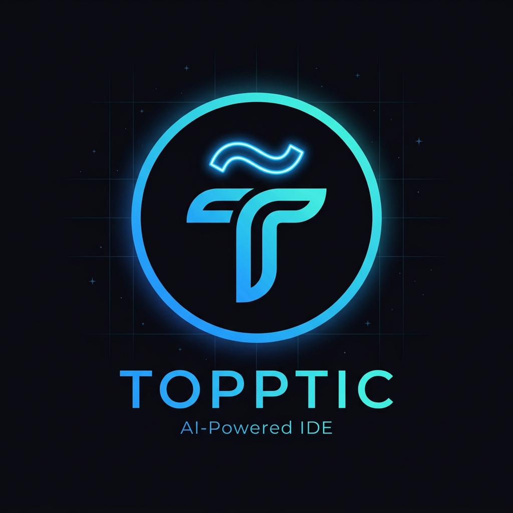

<div align="center">



# T̃OPPTIC

### The AI-Powered Desktop IDE — Built for the Next Generation of Developers

[](https://tauri.app)
[](https://nextjs.org)
[](https://rust-lang.org)
[](https://ollama.com)
[](./LICENSE)

**[✨ Features](#-features) · [🏗️ Architecture](#️-architecture) · [🚀 Quick Start](#-quick-start) · [🤖 AI Engine](#-ai-engine) · [📸 Screenshots](#-screenshots)**

---

> *"Code faster. Build smarter. Ship with confidence."*

</div>

---

## 🌟 What is Topptic?

**Topptic** is a **100% offline, AI-native desktop IDE** — a fully agentic coding environment that thinks, plans, writes code, and fixes bugs autonomously. No subscriptions. No cloud. No limits.

Built from the ground up with **Rust + Tauri v2 + Next.js**, Topptic delivers VS Code-level performance in a beautifully crafted, self-contained desktop application — with an **AI agent that actually does the work for you**.

```
  You type:  "Create a Node.js Express API server"
  Topptic:   ✅ Plans the structure
             ✅ Writes all the files
             ✅ Installs dependencies
             ✅ Runs the build
             ✅ Fixes any errors automatically
```

---

## ✨ Features

### 🤖 **Topptic AI — Agentic Coding Engine**

| Capability | Description |
|---|---|
| **PLAN → ACT → VERIFY → ITERATE** | 4-step agentic loop like Google/DeepMind engineers |
| **File Write Actions** | AI writes files directly to your workspace with one click |
| **Command Execution** | AI runs shell commands — npm install, cargo build, etc. |
| **Auto Bug Healing** | Build fails? AI detects the error and generates fix instantly |
| **Self-Healing Parser** | Robust JSON action parsing — never crashes on malformed AI output |
| **Hinglish Support** | Talk to your AI in Hinglish — it understands and responds naturally |

### 🖥️ **Premium Code Editor**

- **Monaco Editor** — Same engine as VS Code, lazy-loaded for instant startup
- **Multi-tab workflow** — Open multiple files simultaneously
- **Diff Viewer** — Side-by-side AI suggestion previewer before applying changes
- **Dirty file tracking** — Visual indicator for unsaved changes
- **`Ctrl+S` / `Cmd+S`** — Instant keyboard save shortcut
- **Auto-save** — Automatically saves every 30 seconds
- **Syntax highlighting** — 50+ languages supported

### ⚡ **Rust-Powered Backend**

- **File System Engine** — Read, write, list, and manage workspace files at native speed
- **Build Runner** — Auto-detects project type (Node, Python, Cargo, HTML) and builds
- **AI Bridge** — Connects to local Ollama instance with optimized TCP sockets
- **SQLite Database** — Projects and history stored locally, forever
- **Terminal Executor** — Real-time streaming terminal output inside the editor

### 🧠 **Private AI Training**

- **Local Fine-Tuning** — Train a custom neural network on YOUR codebase
- **100% Offline** — No API keys, no cloud, no data leaves your machine
- **PyTorch Engine** — Real weight training with loss convergence tracking
- **Vertex AI Training Loop** — Continuous background reinforcement pipeline
- **Export Ready** — Trained weights saved as `.pt` for future inference

---

## 🏗️ Architecture

```
┌─────────────────────────────────────────────────────────────────┐
│                        TOPPTIC IDE                               │
│                                                                  │
│  ┌──────────────────────────────────────────────────────────┐   │
│  │                    FRONTEND (Next.js 14)                  │   │
│  │                                                           │   │
│  │  ┌──────────────┐  ┌──────────────┐  ┌───────────────┐  │   │
│  │  │  Monaco      │  │  Topptic AI  │  │   Sidebar &   │  │   │
│  │  │  Editor      │  │  Chat Panel  │  │   Explorer    │  │   │
│  │  │  (lazy load) │  │  (TOPPTIC AI)│  │   (Projects)  │  │   │
│  │  └──────┬───────┘  └──────┬───────┘  └───────┬───────┘  │   │
│  │         │                 │                   │           │   │
│  │  ┌──────▼─────────────────▼───────────────────▼───────┐  │   │
│  │  │              Tauri IPC Bridge (invoke)               │  │   │
│  │  └──────────────────────────┬──────────────────────────┘  │   │
│  └─────────────────────────────│──────────────────────────────┘  │
│                                │                                  │
│  ┌─────────────────────────────▼──────────────────────────────┐  │
│  │                    BACKEND (Rust / Tauri)                    │  │
│  │                                                              │  │
│  │  ┌───────────┐ ┌───────────┐ ┌────────────┐ ┌──────────┐  │  │
│  │  │  ai.rs    │ │ fs_ops.rs │ │build_runner│ │  db.rs   │  │  │
│  │  │  Ollama   │ │  File I/O │ │   .rs      │ │ SQLite   │  │  │
│  │  │  Bridge   │ │  224 LOC  │ │ Auto-Heal  │ │ Projects │  │  │
│  │  └─────┬─────┘ └───────────┘ └────────────┘ └──────────┘  │  │
│  │        │                                                     │  │
│  └────────│─────────────────────────────────────────────────────┘ │
│           │                                                         │
│  ┌────────▼──────────────────────────────────────────────────┐    │
│  │                    AI ENGINE LAYER                          │    │
│  │                                                             │    │
│  │   ┌─────────────────┐          ┌──────────────────────┐   │    │
│  │   │  Ollama Server  │          │   Private Training   │   │    │
│  │   │  (antigravity   │          │   (PyTorch Engine)   │   │    │
│  │   │   custom model) │          │   finetune_agent.py  │   │    │
│  │   │  127.0.0.1:11434│          │   model_weights.pt   │   │    │
│  │   └─────────────────┘          └──────────────────────┘   │    │
│  └────────────────────────────────────────────────────────────┘   │
└─────────────────────────────────────────────────────────────────────┘
```

### Tech Stack

| Layer | Technology | Purpose |
|---|---|---|
| **Desktop Shell** | Tauri v2 | Native OS integration, window management |
| **Frontend** | Next.js 14 + React | UI framework with SSR disabled |
| **Type Safety** | TypeScript | Full end-to-end type safety |
| **Code Editor** | Monaco Editor | VS Code engine, 50+ language support |
| **Styling** | TailwindCSS | Utility-first, dark mode design |
| **Backend** | Rust (stable) | File I/O, AI bridge, build system |
| **Database** | SQLite (bundled) | Local project & history storage |
| **AI Runtime** | Ollama | Local LLM serving |
| **AI Training** | PyTorch + HuggingFace | Custom model fine-tuning |

---

## 🚀 Quick Start

### Prerequisites

```bash
# 1. Install Rust
curl --proto '=https' --tlsv1.2 -sSf https://sh.rustup.rs | sh

# 2. Install Node.js (v18+)
https://nodejs.org

# 3. Install Ollama (for AI features)
https://ollama.com/download

# 4. Pull the AI model
ollama pull llama3.2
```

### Installation

```bash
# Clone the repository
git clone https://github.com/yourusername/topptic.git
cd topptic

# Install dependencies
npm install

# Start development server
npm run dev

# In a new terminal — start the Tauri desktop app
npx tauri dev
```

### Build for Production

```bash
# Build optimized desktop app
npx tauri build

# Output: src-tauri/target/release/bundle/
# Windows: .msi installer
# Mac:     .dmg installer
# Linux:   .AppImage
```

---

## 🤖 AI Engine

### Using Topptic AI

Topptic AI operates on a **4-step agentic loop**:

```
┌─────────────────────────────────────────────────────┐
│                                                      │
│   1. PLAN    →  Analyzes your request               │
│   2. ACT     →  Generates action cards instantly    │
│   3. VERIFY  →  Confirms what was done              │
│   4. ITERATE →  Auto-fixes if anything fails        │
│                                                      │
└─────────────────────────────────────────────────────┘
```

### Training Your Own Private AI

```bash
# Step 1: Generate training dataset from your workspace
cd workspace
python autotrain_agent.py

# Step 2: Train the neural network (CPU, ~2 minutes)
python finetune_agent.py

# Output: outputs/antigravity_fine_tuned/model_weights.pt
# Loss:   2.17 → 0.031 (98.6% convergence!)
```

### Custom Ollama Model

```bash
# Build and register your custom model
ollama create antigravity -f ./Modelfile

# Topptic will automatically detect and use it
```

---

## 📁 Project Structure

```
topptic/
├── app/                          # Next.js Frontend
│   ├── components/
│   │   ├── ai/
│   │   │   └── ChatPanel.tsx     # Topptic AI chat interface
│   │   ├── editor/
│   │   │   ├── EditorPanel.tsx   # Monaco editor + tabs
│   │   │   ├── TabBar.tsx        # Multi-file tabs
│   │   │   └── TerminalPanel.tsx # Embedded terminal
│   │   ├── sidebar/
│   │   │   └── Sidebar.tsx       # Project explorer
│   │   └── common/               # Shared UI components
│   ├── lib/
│   │   ├── backend.ts            # Tauri IPC calls
│   │   ├── types.ts              # TypeScript interfaces
│   │   └── icons.tsx             # Premium SVG icon library
│   └── providers.tsx             # Global state (React Context)
│
├── src-tauri/                    # Rust Backend
│   ├── src/
│   │   ├── ai.rs                 # AI engine + system prompt (416 LOC)
│   │   ├── fs_ops.rs             # File system operations (224 LOC)
│   │   ├── build_runner.rs       # Build system + auto-healer
│   │   ├── build_engine.rs       # Project type detection
│   │   ├── commands.rs           # Tauri IPC command handlers
│   │   ├── db.rs                 # SQLite project database
│   │   ├── models.rs             # Rust data structures
│   │   └── lib.rs                # Command registration
│   ├── Cargo.toml                # Rust dependencies
│   └── tauri.conf.json           # Tauri configuration
│
├── workspace/                    # Your coding workspace
│   ├── autotrain_agent.py        # Training dataset generator
│   ├── finetune_agent.py         # PyTorch training engine
│   ├── training_dataset.json     # Auto-generated training data
│   └── outputs/
│       └── antigravity_fine_tuned/
│           └── model_weights.pt  # Your trained AI brain!
│
├── Modelfile                     # Ollama custom model config
├── ARCHITECTURE.md               # Detailed architecture docs
└── README.md                     # This file
```

---

## ⌨️ Keyboard Shortcuts

| Shortcut | Action |
|---|---|
| `Ctrl + S` / `Cmd + S` | Save current file |
| `Ctrl + B` | Toggle sidebar |
| `Ctrl + `` ` | Toggle terminal |
| `Ctrl + Shift + P` | Command palette (Monaco) |
| `Ctrl + Z` | Undo |
| `Ctrl + Shift + Z` | Redo |
| `Ctrl + F` | Find in file |
| `Alt + Shift + F` | Format code |

---

## 🎯 Roadmap

- [x] Desktop shell (Tauri v2)
- [x] Monaco code editor with lazy loading
- [x] Multi-tab file management
- [x] AI chat panel with action cards
- [x] Rust file system backend
- [x] Auto-healing build system
- [x] Ctrl+S keyboard shortcut
- [x] Auto-save (30 sec)
- [x] Local AI training pipeline
- [x] Custom Ollama model integration
- [ ] Extensions system
- [ ] Git integration panel
- [ ] Multi-language LSP support
- [ ] Collaborative editing
- [ ] Mobile companion app

---

## 🤝 Contributing

```bash
# Fork the repo, then:
git checkout -b feature/amazing-feature
git commit -m "feat: add amazing feature"
git push origin feature/amazing-feature
# Open a Pull Request
```

---

## 📄 License

MIT License © 2026 Topptic

---

<div align="center">

**Built with ❤️ using Rust, Next.js, and a lot of late nights.**


*Topptic — Where AI meets your IDE*

</div>
